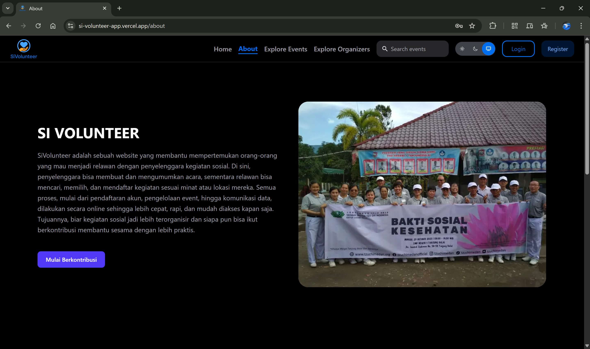

# SiVolunteer 🌟


**SiVolunteer** adalah platform web untuk memfasilitasi interaksi antara penyelenggara kegiatan sosial (organizer) dan relawan (member). Aplikasi ini memungkinkan pengguna untuk menemukan, mendaftar, dan mengelola kegiatan sukarela dengan mudah, serta membantu penyelenggara dalam mempublikasikan acara dan mengelola partisipan.

---

## Fitur Utama ✨

- **Autentikasi & Otorisasi**
  - Login & Register (role: Member, Organizer, Admin)
  - Aktivasi akun via email
- **Manajemen Event**
  - CRUD acara oleh organizer
  - Pendaftaran member ke acara
  - List event publik
- **Manajemen Organizer**
  - Profil & kontak penyelenggara
  - Verifikasi data
- **Manajemen member**
  - Profil member
  - Riwayat partisipasi
- **Pencarian & Filter**
  - Cari acara berdasarkan kategori, lokasi, dan tanggal
- **Upload & Manajemen Gambar**
  - Upload foto event dan profil

---

## Tech Stack 🛠️

- **Bahasa**: TypeScript 🟦
- **Framework**: Next.js ⚛️
- **UI Library**: HeroUI 🎨
- **Styling**: Tailwind CSS 💨
- **Data Fetching**: Axios, React Query ⚡
- **Validasi**: Yup ✅
- **Carousel**: Swiper 🎠
- **Icons**: React Icons 🔤
- **Notifications**: React Toastify 🔔
- **Database**: MongoDb 📝
- **Deployment**: Vercel 🌐

---

## Instalasi & Menjalankan 🚀

1.  **Clone repositori:**

    ```bash
    git clone https://github.com/Ibrhm1/SiVolunteer.App
    cd SiVolunteer.App
    ```

2.  **Install dependensi:**

    ```bash
    npm install
    ```

3.  **Konfigurasi Environment:**
    Buat file .env di root direktori proyek. Isi dengan variabel lingkungan yang dibutuhkan, seperti:

    ```
    NEXT_PUBLIC_API_URL: "your_api_url"
    NEXT_AUTH_SECRET: "your_secret"
    ```

4.  **Jalankan proyek:**

    ```bash
    npm run dev
    ```

---

## Link deploy 🌐

Aplikasi yang sudah dideploy: **[SiVolunteer.App](https://si-volunteer-app.vercel.app/)**

## 🔑 Demo Akun

Gunakan akun-akun berikut untuk mencoba aplikasi tanpa perlu registrasi:

| Role      | Email                       | Username                  | Password    |
| --------- | --------------------------- | ------------------------- | ----------- |
| Admin     | admin@sivolunteer.com       | admin_demo                | Password123 |
| Organizer | bacacerah.id@gmail.com      | Komunitas Baca Cerah      | Organizer1  |
| Organizer | harapan.nusantara@gmail.com | Yayasan Harapan Nusantara | Organizer1  |
| Member    | raka.dirgantara@example.com | rakadgt                   | Member12    |
| Member    | elvino.mahesa@gmail.com     | elvinom                   | Member12    |

## 🔄 Flow System – SiVolunteer

### 1️⃣ Role & Akses

- **Admin**
  - Mengelola semua data (user, event, kategori, region)
- **Organizer**
  - Membuat, mengedit, dan menghapus event
  - Mengelola peserta (member)
  - Mengelola profil organisasi
- **Member**
  - Mencari dan mendaftar event
  - Mengelola profil pribadi
  - Melihat riwayat partisipasi

---

### 2️⃣ Alur Pengguna

1. **Registrasi**
   - Member & Organizer membuat akun
   - Sistem mengirimkan email aktivasi
2. **Login**
   - Masuk sesuai role (Admin, Organizer, Member)
3. **Akses Berdasarkan Role**
   - **Member:** Cari & daftar event
   - **Organizer:** Kelola event & peserta
   - **Admin:** Kelola semua data & verifikasi
4. **Manajemen Event**
   - Organizer membuat event
   - Member mendaftar
   - Organizer mengonfirmasi pendaftaran
5. **Riwayat & Laporan**
   - Member melihat riwayat event
   - Organizer & Admin melihat laporan partisipasi

## Tampilan 📸


